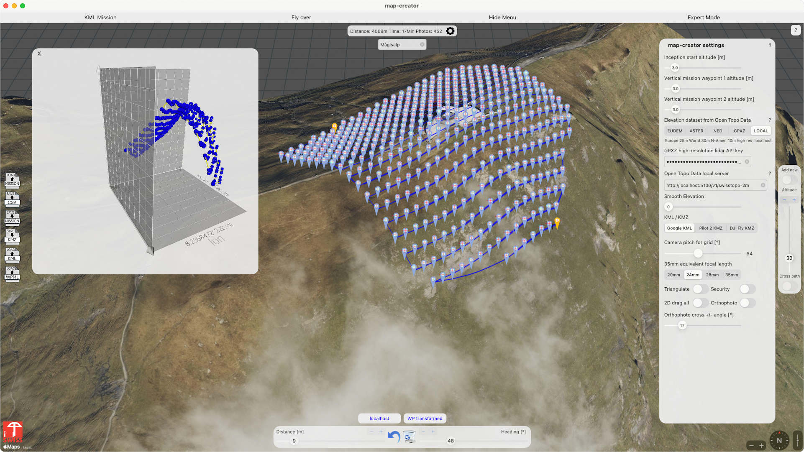
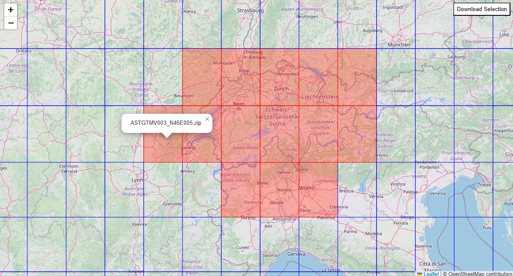

# Python GeoTIFF's with Open Topo Date or GDAL

In this repository, you will find Python programs that allow you to retrieve precise elevation data from GEOTIFF files using Open Topo Data or GDAL for Python.
The WGS84 formats are supported. You will learn how to install a local server for OPEN TOPO DATA and how to install GDAL for Python.

The [map-creator](https://apps.apple.com/us/app/map-creator/id1549471927) uses GeoTIFF's to create terrain follow AGL missons. 

## Elevation with Open Topo Data
### Open Topo Data Server

[Open Topo Data](https://www.opentopodata.org/) is a REST API server for your elevation data. It is open source. 

`https://api.opentopodata.org/v1/aster30m?locations=46.5776,8.0059|46.5586,7.9856|46.5475,7.9625`

```Json
{
  "results": [
    {
      "dataset": "aster30m",
      "elevation": 3876.0,
      "location": {
        "lat": 46.5776,
        "lng": 8.0059
      }
    },
    {
      "dataset": "aster30m",
      "elevation": 3331.0,
      "location": {
        "lat": 46.5586,
        "lng": 7.9856
      }
    },
    {
      "dataset": "aster30m",
      "elevation": 3375.0,
      "location": {
        "lat": 46.5475,
        "lng": 7.9625
      }
    }
  ],
  "status": "OK"
}
```
With this small Python program you get access to Open Topo Data. The Json response will be translated into an Array `[[lat, lon, elev]]`
```Py
import requests

API_URL = "https://api.opentopodata.org/v1/aster30m"
coords = [
    [46.5776, 8.0059],   # Eiger
    [46.5586, 7.9856],   # Mönch
    [46.5475, 7.9625],   # Jungfrau
]

# Transform coordinates in "lat,lon|lat,lon|..."
locations = "|".join([f"{lat},{lon}" for lat, lon in coords])

# Send request
response = requests.get(API_URL, params={"locations": locations})
data = response.json()

# Compile results
result = []
for coord, res in zip(coords, data["results"]):
    lat, lon = coord
    elev = res.get("elevation")
    result.append([lat, lon, elev])
    print(f"{lat}, {lon} → {elev:.1f} m")
```
You get this response.
```Console
46.5776, 8.0059 → 3876.0 m
46.5586, 7.9856 → 3331.0 m
46.5475, 7.9625 → 3375.0 m
``` 
##Install Open Topo Data on Windows 11
The easiest way to run Open Topo Data is with Docker.

Get [docker](https://docs.docker.com/desktop/setup/install/windows-install/) for Windows.
You need [git](https://git-scm.com/downloads/win) for Windows too.
```Console
git clone https://github.com/ajnisbet/opentopodata.git
cd opentopodata
```
###Dockerfile
I modified the Dockerfile for Windows. Replace the Dockerfile from the repository with tis one. 

```Console
FROM python:3.11.10-slim-bookworm as builder
# Add modifiction for Windows 11
RUN set -e && \
    apt-get update && \
    apt-get install -y --no-install-recommends \
        build-essential \
        python3-dev \
        libpcre3-dev \
        gcc \
        g++ \
        make \
        && rm -rf /var/lib/apt/lists/*
# Container for packages that need to be built from source but have massive dev dependencies.
RUN set -e && \
    apt-get update && \
    apt-get install -y --no-install-recommends \
        gcc \
        python3.11-dev

RUN pip config set global.disable-pip-version-check true && \
    pip wheel --wheel-dir=/root/wheels uwsgi==2.0.28 && \
    pip wheel --wheel-dir=/root/wheels regex==2024.11.6 

# The actual container.
FROM python:3.11.10-slim-bookworm
RUN set -e && \
    apt-get update && \
    apt-get install -y --no-install-recommends \
        inotify-tools \
        nano \
        nginx \
        memcached \
        supervisor && \
    rm -rf /var/lib/apt/lists/*

COPY --from=builder /root/wheels /root/wheels
COPY requirements.txt /app/requirements.txt
RUN pip install \
        --no-index \
        --no-cache-dir \
        --disable-pip-version-check \
        --find-links=/root/wheels \
        uwsgi regex && \
    pip install --no-cache-dir --disable-pip-version-check --default-timeout=1000 -r /app/requirements.txt && \
        rm -rf /root/.cache/pip/* && \
        rm root/wheels/* && \
        rm /app/requirements.txt

WORKDIR /app
COPY . /app/

RUN echo > /etc/nginx/sites-available/default && \
    cp /app/docker/nginx.conf /etc/nginx/conf.d/nginx.conf && \
    cp /app/docker/supervisord.conf /etc/supervisor/conf.d/supervisord.conf

CMD ["sh", "/app/docker/run.sh"]
EXPOSE 5000

ENV CURL_CA_BUNDLE=/etc/ssl/certs/ca-certificates.crt
ENV GDAL_DISABLE_READDIR_ON_OPEN=TRUE
ENV GDAL_NUM_THREADS=ALL_CPUS
ENV GDAL_CACHEMAX=512
```
###config.yaml
We have to edit the `config.yaml` file to put in our dataset.
```Console
max_locations_per_request: 100 
access_control_allow_origin: '*'
datasets:
- name: aster30m
  path: data/aster30m/
```
###Add GeoTIFF dataset
Now we need a dataset. We will use ASTER from the NASA. ASTER GDEM is a 1 arc-second resolution, corresponding to a resolution of about 30m at the equator. Coverage is provided from from -83 to 83 degrees latitude. This dataset has 22'912 tiles. We will only download tiles for our region. I build a python program to make this easy.

 

Use this python program `Download-Aster-GeoTiff.py` from this repository. The program will unzip the GeoTIFF files and remove all `*num.tif` files. Copy your GeoTIFF files into `/your path/opentopodata/data/aster30m`

###Build the local server
Now you can run the build.
```Console
docker build --tag opentopodata --file docker/Dockerfile .
```
###Run the local server
If the build is successfull you can run the server. I use port 5100. The port 5000 is already in use on Mac OS. 
```Console
docker run --rm -it --volume C:/daten/github/opentopod```ata/data:/app/data:ro -p 5100:5000 -e N_UWSGI_THREADS=4 opentopodata sh -c "/usr/bin/supervisord -c /app/docker/supervisord.conf"
```
Now we can test the server. Replace the url adress in the python program. 
```Console
# API_URL = "https://api.opentopodata.org/v1/aster30m"
API_URL = "http://localhost:5100/v1/aster30m"
```
##Elevation with Python GDAL on Windows
We will install GDAL for Python on Windows. Instead of building GDAL yourself, you can install ready-made wheels. Find the right version of Python and GDAL that work together. First you need to know your python version `python --version`. You must use the wheel for your version. 

List of compatible versions (unofficial but very [reliable Windows builds](https://github.com/cgohlke/geospatial-wheels/releases/tag/v2025.7.4) by Christoph Gohlke).

Install the wheel. `pip install path\to\GDAL-3.7.2-cp311-cp311-win_amd64.whl`. Python 3.11 on 64bit for example.

##Elevation with Python GDAL on Mac OS
Use the correct brew for Mac Silicon or Intel. The terminal must not use Rosetta on Mac Silicon. 
```Console
uname -m
brew update
brew install gdal
gdalinfo –version
pip install GDAL=version
```
Homebrew uses `/opt/homebrew/Cellar/gdal/<version>/` on Mac Silicon.

###Mac Silicon Homebrew
```console
/opt/homebrew/bin/      → e.g. gdalinfo, ogr2ogr, gdal_translate
/opt/homebrew/lib/      → e.g. libgdal.dylib
/opt/homebrew/include/  → Header-Data
/opt/homebrew/share/    → Data and formats
```

###Intel Homebrew
```console
local/Cellar/gdal/<version>/
/usr/local/bin/
/usr/local/lib/
```
Now we can test the installation with our small python program. Use the dem_aster.tif from this repository for this example. I merged 2 Aster30m tiles for this example. 
```Py
from osgeo import gdal
import numpy as np
gdal.UseExceptions()

def get_elevation(lat, lon, dataset):
    """Get elevation im m from GeoTIFF for lat/lon"""
    gt = dataset.GetGeoTransform()
    inv_gt = gdal.InvGeoTransform(gt)
    px, py = gdal.ApplyGeoTransform(inv_gt, lon, lat)
    
    px, py = int(px), int(py)
    band = dataset.GetRasterBand(1)
    data = band.ReadAsArray(px, py, 1, 1)
    
    if data is None:
        return None
    return float(data[0,0])

if __name__ == "__main__":
    # Load ASTER DEM 
    dem_path = "dem_aster.tif"
    ds = gdal.Open(dem_path)

    coords = [
        [46.5776, 8.0059],   # Eiger
        [46.5586, 7.9856],   # Mönch
        [46.5475, 7.9625],   # Jungfrau
    ]

    for lat, lon in coords:
        h = get_elevation(lat, lon, ds)
        print(f"{lat}, {lon} → {h:.1f} m")
```
You get this response.
```Console
46.5776, 8.0059 → 3876.0 m
46.5586, 7.9856 → 3331.0 m
46.5475, 7.9625 → 3375.0 m
```
If you call gdal... in your python program the home directory will change. You can use absolute path to avoid problems.

```console
Fine DEM (0.5m): (2000, 2000)
Coarse DEM (2m): (500, 500) 
Scalefactor: x=4.00, y=4.00 
nearest  → RMSE=0.523, MAE=0.329 
bilinear → RMSE=0.397, MAE=0.243  
cubic    → RMSE=0.396, MAE=0.242 
```

```js
Func Test()
    frameborder()
```

```python
methods = {
    "nearest": 0,
    "bilinear": 1,
    "cubic": 3
}
```

##Windows 11 GDAL Python Installation
Instead of building GDAL yourself, you can install ready-made wheels:
Find the right version of Python and GDAL that work together. → List of compatible versions (unofficial but very reliable Windows builds by Christoph Gohlke).
[GDAL wheels Windows 11](https://github.com/cgohlke/geospatial-wheels/releases/tag/v2025.7.4)

```python --version```

Download the .whl for your Python version `(e.g. GDAL-3.7.2-cp311-cp311-win_amd64.whl for Python 3.11, 64-bit).`

Install it manually:

```console
pip install path\to\GDAL-3.7.2-cp311-cp311-win_amd64.whl
```

Important: The Python version and architecture (32/64-bit) must match exactly!

##Mac OS GDAL Python installation
Use the correct brew for Mac Silicon or Intel. The terminal must not use Rosetta on Mac Silicon. 

```console
uname -m
brew update
brew install gdal
gdalinfo -–version
pip install GDAL==version
```
###Homebrew uses /opt/homebrew/Cellar/gdal/<version>/ on Mac Silicon.

```console
/opt/homebrew/bin/      → z.B. gdalinfo, ogr2ogr, gdal_translate
/opt/homebrew/lib/      → z.B. libgdal.dylib
/opt/homebrew/include/  → Header-Dateien
/opt/homebrew/share/    → Daten und Formate
```

###Intel Homebrew
```console
local/Cellar/gdal/<version>/
/usr/local/bin/
/usr/local/lib/
```
